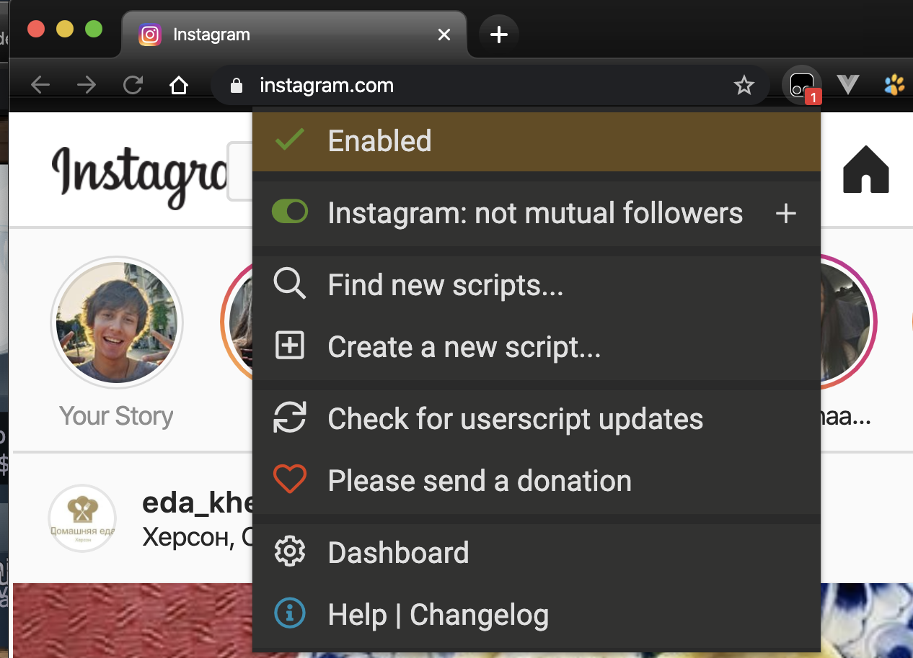
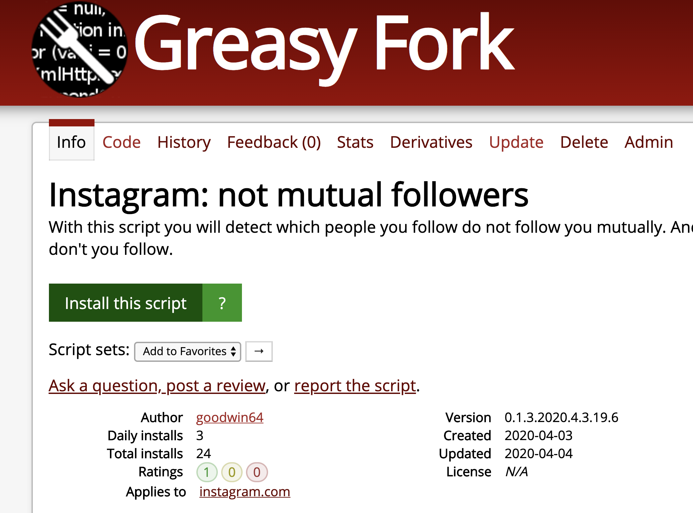
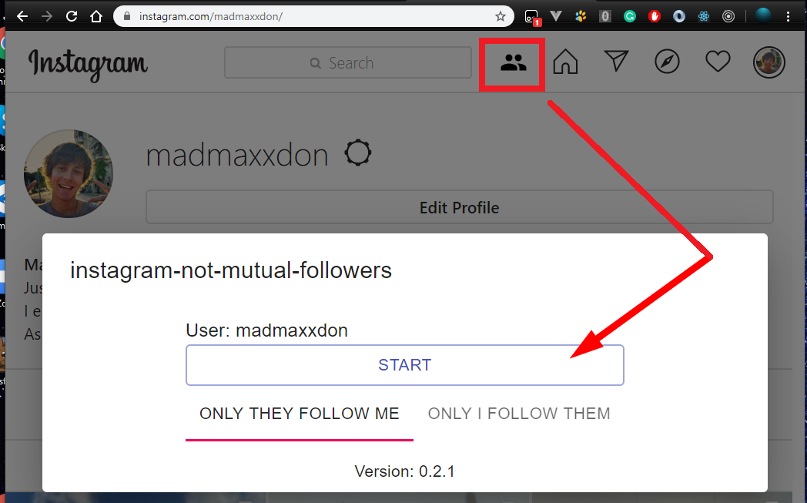
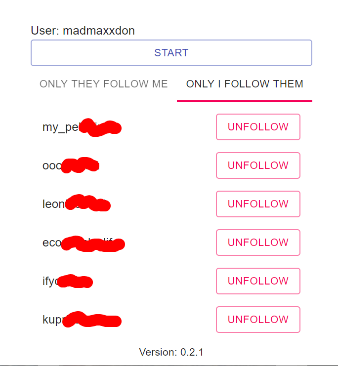
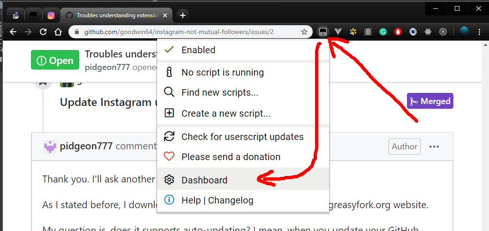
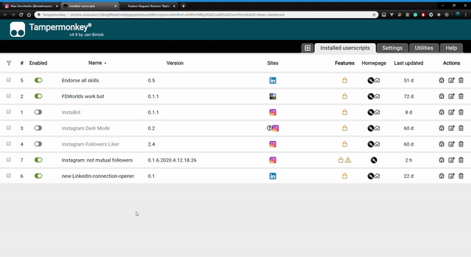

# Table of Contents
- [What is it all about](#what-is-it-all-about)
- [Usage instruction](#usage-instruction)
- [How to update the script](#how-to-update-the-script)
- [How to contribute](#how-to-contribute)

# What is it all about
> This script allows users understand which of the users they follow do not follow them back

# Usage instruction
1. Install [TamperMonkey extension](https://chrome.google.com/webstore/detail/tampermonkey/dhdgffkkebhmkfjojejmpbldmpobfkfo?hl=en).  
After successful installation you'll see the following in your browser top panel:  
  
2. Navigate to this script hosted on [GreasyFork](https://greasyfork.org/en/scripts/399405-instagram-not-mutual-followers)  
  
3. Install it (or reinstall if you've already installed it once)  
4. Navigate to the Instagram  
  
5. Navigate to user profile, click helper button. Dialog will appear.  
6. Click "start" button. Wait for the list of followers/following to be loaded and analyzed.  
  
7. See the lists of users.  
8. For instance, these users do not follow me, while I follow them (usually celebrities or people that use Instagram rarely or haven't noticed my following request):  
  

*Beware* that this script works only in a web view, NOT within Android/iOS app.

# How to update the script
1. Open TamperMonkey dashboard:
  
2. Find the script and click on "last updated" cell. It will check whether there are script updates:  
  

# FAQ
- Why is this script free?  
  - I wrote it for myself. And then I decided to share it with the community that gave me knowledge for writing this script for free as well.
- Is this script secure? Can it steal my password?
  - This script is **absolutely secure**. Instagram website doesn't store your password. Therefore, nor this script, neither others can steal the secure information.

# How to contribute
1. Create an issue with the idea/suggestion/bug report/question 💡
2. Discuss it 💬
3. Create a PR with an implementation from your fork ⇄
4. Earning your brownie points 🏆
